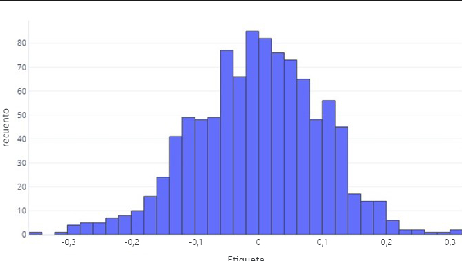
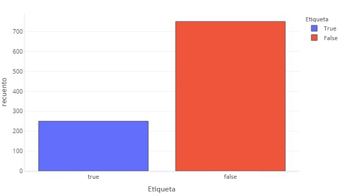
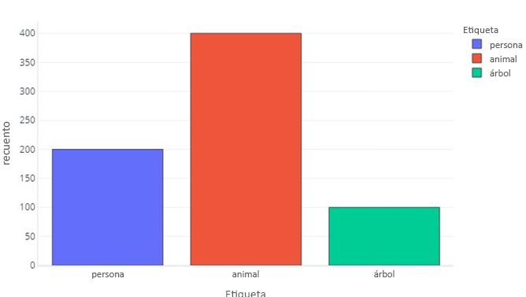
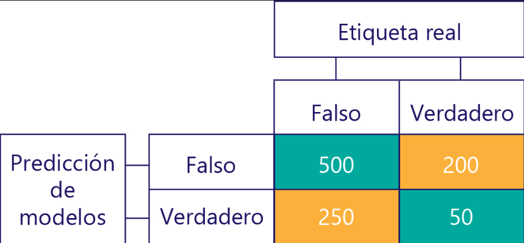
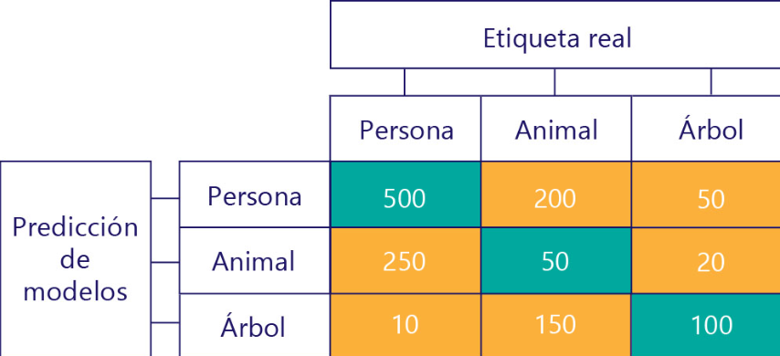

# Matriz de confusión y desequilibrios de datos

Las matrices de confusión son un medio de **evaluar** el rendimiento de un modelo categórico. Es una herramienta para evaluar modelos de clasificación, mostrando cuántas veces las predicciones coinciden o difieren de la realidad. 

Para saber cómo funcionan, primero vamos a refrescar nuestros conocimientos sobre los __datos continuos__. A través de esto, podemos ver cómo las matrices de confusión son simplemente una extensión de los histogramas que ya conocemos.
### Distribuciones de datos continuos

Podemos ver que la etiqueta es, por término medio, aproximadamente cero y que la mayoría de los puntos de datos se encuentra entre -1 y 1. Aparece como simétrico: hay un número aproximadamente igual de números más pequeños y más grandes que la media. Si quisiéramos, podríamos usar una tabla en lugar de un histograma, pero podría ser difícil de manejar.

### Distribuciones de datos categóricos

Los datos categóricos y continuos comparten similitudes, como la posibilidad de usar histogramas para analizar la distribución de valores. Por ejemplo, una etiqueta binaria (verdadero/falso) puede representarse en un histograma según su frecuencia.

Esto nos indica que hay 750 muestras con la etiqueta "false" y 250 con la etiqueta "true".

Una etiqueta para tres categorías es parecida:

### Consulta de las predicciones

Podemos examinar las predicciones que realiza el modelo igual que observamos las etiquetas reales de nuestros datos. Por ejemplo, podríamos ver que, en el conjunto de pruebas, nuestro modelo predijo "false" 700 veces y "true" 300 veces.

Proporciona información directa sobre las predicciones que realiza nuestro modelo, pero no nos dice cuáles de ellas son correctas. Aunque podemos usar una `función de costo` para comprender la frecuencia con la que se dan las respuestas correctas, la **función de costo** no nos dirá qué tipos de errores se están cometiendo. Por ejemplo, el modelo podría adivinar correctamente todos los valores "true", pero también adivinar "true" cuando debería haber adivinado "false".

Cada celda de la matriz de confusión nos indica algo sobre el rendimiento del modelo. Se trata de verdaderos negativos (TN), falsos negativos (FN), falsos positivos (FP) y verdaderos positivos (TP).

- **Verdaderos negativos (TN True Negative):**
Son los casos en los que el modelo predijo "false" y la etiqueta real también era "false". En este caso, ocurrió 500 veces. Es un buen indicador de la capacidad del modelo para identificar correctamente los valores negativos.

- **Falsos negativos (FN):**
Representan los casos en los que el modelo predijo "false", pero en realidad la etiqueta era "true". Ocurrió 200 veces. Esto indica que el modelo no identificó correctamente algunos casos positivos.

- **Falsos positivos (FP):**
Ocurre cuando el modelo predice "true", pero la etiqueta real era "false". En este caso, sucedió 250 veces. Esto significa que el modelo detectó erróneamente casos positivos cuando no lo eran.

- **Verdaderos positivos (TP True Positive):**
Son los casos en los que el modelo predijo "true" correctamente. En este caso, ocurrió 50 veces. Representa la capacidad del modelo para identificar correctamente los valores positivos.

#### Tres categorías

Cuando hay tres categorías, ya no se aplican métricas como verdaderos positivos, pero todavía podemos ver exactamente con qué frecuencia el modelo ha cometido ciertos tipos de errores. Por ejemplo, podemos ver que el modelo predijo esa "persona" 200 veces cuando el resultado correcto real fue "animal".

# Data imbalances (Datos debalanceados)

Cuando nuestras etiquetas de datos tienen más de una categoría que otra, se dice que tenemos un desequilibrio de datos.

Los desequilibrios de datos son problemáticos porque los modelos pueden aprender a predecir solo la clase mayoritaria, ignorando casos importantes. 

### ¿Por qué son importantes los desequilibrios de datos?
Por ejemplo, en un modelo de excursionista/no excursionista entrenado con datos desbalanceados, el modelo podría predecir siempre "no excursionista", logrando una alta precisión pero sin ser útil para identificar realmente a un excursionista en peligro.

### Sesgo en una matriz de confusión
En el análisis de matrices de confusión, se busca identificar si hay sesgo en los datos o en el modelo. En un escenario ideal, los datos y las predicciones deben estar equilibrados, es decir, las etiquetas de entrada deben ser aproximadamente iguales en número, y el modelo debe hacer predicciones igualmente distribuidas entre las etiquetas.

En un ejemplo sin sesgo, tanto los datos de prueba como las predicciones del modelo están equilibrados (por ejemplo, 500 "true" y 500 "false"). Esto indica que ni los datos ni el modelo están sesgados.

Por otro lado, en un conjunto de datos sesgado, una etiqueta domina (como 400 verdaderos negativos y 100 verdaderos positivos). Además, un modelo sesgado tiende a predecir principalmente una clase, lo que refleja un sesgo en las predicciones (por ejemplo, 400 verdaderos negativos y 400 falsos negativos).

El análisis de la matriz de confusión ayuda a detectar estos desequilibrios y a evaluar el rendimiento de un modelo.

### El sesgo del modelo no es la precisión

Un modelo puede tener una precisión del 50%, pero aún estar sesgado, como en el caso de una matriz de confusión donde el modelo acierta solo 10 de cada 500 predicciones, con la mayoría de respuestas incorrectas, pero las etiquetas de entrada y las predicciones están equilibradas.

El objetivo es que el modelo sea tanto preciso como no sesgado. Un modelo no sesgado y preciso tendría distribuciones equilibradas entre las clases de predicciones y etiquetas reales. Sin embargo, incluso si un modelo es preciso, puede estar sesgado si los datos de entrada están desequilibrados, como en un caso donde las etiquetas reales son mayormente "false" y el modelo predice en su mayoría "false", lo que muestra un sesgo en las predicciones.

En resumen, se debe evaluar tanto la precisión como el sesgo del modelo para asegurarse de que no haya desequilibrios en los datos ni en las predicciones.

### Evitar las consecuencias de los datos desequilibrados
Algunas de las formas más sencillas de evitar las consecuencias de los datos desequilibrados son:

- Realizar una mejor selección de datos.
- "Nuevo muestreo" de los datos para que contengan duplicados de la clase de etiqueta minoritaria.
- Realizar cambios en la función de costo para que dé prioridad a las etiquetas menos comunes. 
Por ejemplo, si se da la respuesta incorrecta a Árbol, la función de costo podría devolver 1 mientras que, si se da la respuesta incorrecta a Excursionista, podría devolver 10.

# Funciones de costo frente a métricas de evaluación

En las últimas unidades hemos empezado a ver una división en las funciones de costo, que enseñan el modelo, y las métricas de evaluación, que usamos para evaluar el modelo.

### Todas las funciones de costo pueden ser métricas de evaluación
Todas las funciones de costo pueden ser métricas de evaluación, aunque no necesariamente son intuitivas. 

Por ejemplo, la pérdida logarítmica tiene valores que no son fáciles de interpretar, lo que puede hacer que no sea una métrica fácil de entender a simple vista.

## Algunas métricas de evaluación no pueden ser funciones de costo
- Dificultad para usar algunas métricas como funciones de costo: Algunas métricas no pueden ser fácilmente convertidas en funciones de costo debido a limitaciones prácticas y matemáticas.

- Cálculos complejos: Hay métricas difíciles de calcular, como algo tan subjetivo como "lo perruno que es algo".

- Funciones de costo suaves: Las funciones de costo deberían ser suaves. Por ejemplo, la precisión es útil, pero cambios pequeños en el modelo no suelen tener un gran impacto, lo que puede hacer que las mejoras no sean claras.

- Gráficos con "planicie": Algunos gráficos de funciones de costo tienen áreas planas donde no se observa mucha diferencia en el valor, dificultando la optimización.

- Ajuste de curvas ROC: Para ajustar curvas ROC, es necesario cambiar los umbrales de clasificación. Sin embargo, al final solo se elige un umbral (generalmente 0,5) para el modelo.

### No todo es malo
Aunque puede ser frustrante no usar nuestra métrica favorita como función de costo, esto permite detectar si el modelo está "haciendo trampas", como sobreajustarse a los datos o encontrar atajos para reducir el costo sin aprender una regla general.

Las métricas son simplificaciones y no perfectas, y usarlas como "comprobación de integridad" ayuda a garantizar que el modelo no esté manipulando la función de costo.

Por ejemplo, en problemas de datos desequilibrados o sobreajuste, los modelos pueden aprender a dar respuestas fáciles sin considerar las características.

Usar métricas externas, como contar patas y cabezas en un dibujo de un perro, puede ayudar a identificar si el modelo realmente ha aprendido el concepto o simplemente está optimizando para un valor bajo en la función de costo.
