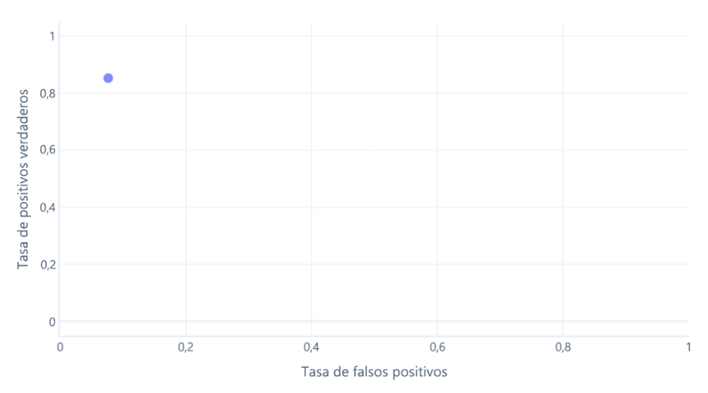
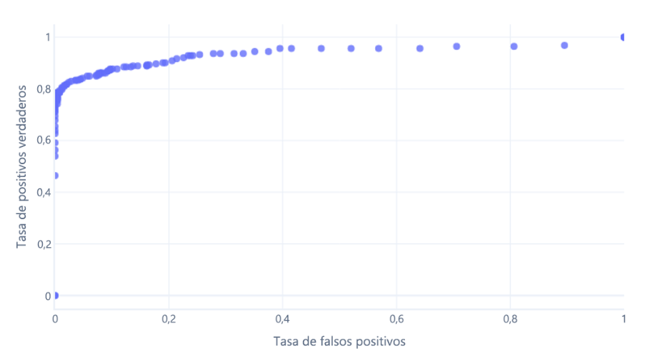
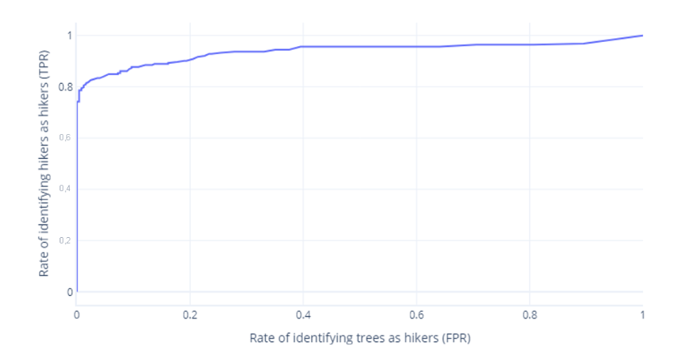

# Análisis de la clasificación con curvas de características operativas del receptor

Los **modelos de clasificación** asignan ejemplos a categorías basándose en características como tamaño, color y movimiento. Para mejorar su rendimiento, es clave equilibrar, limpiar y escalar los datos, ajustar la arquitectura y los hiperparámetros.

En la fase final, los modelos convierten probabilidades en etiquetas usando un umbral, generalmente del 50 %. Sin embargo, si el modelo tiene sesgos, este umbral puede ajustarse para mejorar la precisión. Por ejemplo, si el modelo favorece erróneamente una categoría, modificar el umbral puede corregir esa tendencia.

## Probabilidades y categorías
Los modelos convierten probabilidades en etiquetas mediante un umbral, generalmente del 50 %. Si una categoría supera este valor, se asigna como resultado. Sin embargo, si el modelo tiene sesgos, este umbral puede ajustarse para mejorar la precisión y corregir tendencias incorrectas.

## Actualizador en función de las matrices de decisión
Las matrices de decisión ayudan a evaluar los errores de un modelo mediante tasas de verdaderos positivos (TP), verdaderos negativos (TN), falsos positivos (FP) y falsos negativos (FN).

Dos métricas clave son:

- Tasa de verdaderos positivos (sensibilidad): mide cuántas veces el modelo identifica correctamente una categoría.
- Tasa de falsos positivos: indica con qué frecuencia el modelo clasifica erróneamente una categoría como otra.

Un buen modelo debe tener una alta tasa de VP y una baja tasa de FP para evitar sesgos y clasificaciones incorrectas.

## Curvas ROC
Las curvas de características operativas del receptor (ROC) son un gráfico en el que se traza la tasa de verdaderos positivos frente a la tasa de falsos positivos.

Las curvas de ROC pueden resultar confusas para principiantes por dos motivos principales:
1. El primer motivo es que los principiantes saben que un modelo solo tiene un valor para las tasas de verdaderos positivos y verdaderos negativos, por lo que los trazados de ROC deben ser como este:

Si lo hacemos para umbrales entre el 0 % y el 100 %, podríamos obtener un grafo como el siguiente:

2. El segundo motivo por el que estos gráficos pueden resultar confusos es la jerga implicada. Recuerde que queremos una tasa de verdaderos positivos alta (que identifique a los excursionistas como tales) y una tasa de falsos positivos baja (que no identifique los árboles como excursionistas).

# Comparación y optimización de curvas de ROC
Las curvas de características operativas del receptor (ROC) nos permiten comparar modelos entre sí y ajustar nuestro modelo seleccionado. Vamos a analizar cómo y por qué se realizan.

## Ajuste de un modelo
La curva ROC ayuda a elegir el umbral de decisión óptimo para equilibrar verdaderos positivos (TPR) y falsos positivos (FPR).
Ajustar el umbral afecta la clasificación: un umbral bajo aumenta TPR pero también FPR, mientras que uno alto reduce ambos.
No existe un umbral perfecto; depende del contexto.

Por ejemplo, en rescates, es crucial una alta TPR para no ignorar excursionistas, pero una FPR alta genera falsas alarmas. En ciencia, se prioriza minimizar los falsos positivos para evitar resultados engañosos.

## Comparación de modelos con AUC
Las curvas ROC permiten comparar modelos evaluando su rendimiento en distintos umbrales. Esto ayuda a predecir su efectividad en el futuro y a determinar su dependencia de un umbral específico. Un buen modelo debe mantener un rendimiento estable en varios umbrales, asegurando que su desempeño no se degrade con datos ligeramente diferentes.

### ¿Cómo se comparan las ROC?
La manera más fácil de comparar las ROC numéricamente es usar el área bajo la curva (AUC). Cuanto más perfecto sea un modelo, mayor será esta área. Si tenemos un modelo con una AUC grande, sabemos que funciona bien para diversos umbrales, por lo que probablemente tiene una buena arquitectura y ha recibido un buen entrenamiento. Por el contrario, un modelo con una AUC pequeña (más próxima a 0,5) no funciona bien.