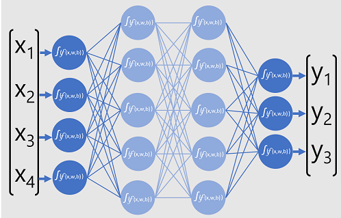

# Introduction

El deep learning es una forma avanzada de aprendizaje automático que trata de imitar cómo aprende el cerebro humano. 

En el cerebro, las neuronas están conectadas entre sí mediante extensiones nerviosas que transmiten señales electroquímicas. Cuando una neurona se activa, pasa la señal a las neuronas a las que está conectada, y estas pueden activarse a su vez. Con el tiempo, las conexiones entre neuronas se fortalecen mediante el uso frecuente, lo que facilita la respuesta a estímulos (por ejemplo, atrapar una pelota).

El deep learning emula este proceso biológico utilizando redes neuronales artificiales que procesan entradas numéricas en lugar de estímulos electroquímicos. Cada entrada (x) tiene un peso (w) que ajusta su efecto, y se añade un sesgo (b) para controlar la red de manera más precisa. Durante el proceso de entrenamiento, los valores de w y b se ajustan para que la red "aprenda" a generar resultados correctos. La neurona realiza un cálculo de una suma ponderada de x, w y b, y utiliza una función de activación para determinar si pasa la salida a la siguiente capa de neuronas.

## Deep neural network concepts

Antes de aprender cómo entrenar un modelo de red neuronal profunda (DNN), es importante entender qué se busca lograr. El aprendizaje automático se centra en predecir una etiqueta a partir de las características de una observación. En términos simples, un modelo de aprendizaje automático es una función que calcula y (la etiqueta) a partir de x (las características): f(x) = y.

### A simple classification example
Este es un ejemplo de un problema de clasificación en aprendizaje automático. En este caso, se tienen medidas de un pingüino, como el tamaño de su pico, la profundidad de su pico, el largo de sus aletas y su peso. Estas medidas conforman un vector de características (x) con cuatro valores. 

- El objetivo es predecir la especie del pingüino (y), que puede ser Adelie, Gentoo o Chinstrap. - El modelo de clasificación debe predecir las probabilidades de cada especie.
- Se entrena utilizando observaciones con etiquetas conocidas, como el caso de un pingüino Adelie, donde el modelo debe asignar una probabilidad del 100% a la especie correcta.

### A deep neural network model
¿Cómo se usaría el aprendizaje profundo para construir un modelo de clasificación para el modelo de clasificación de pingüinos?

Una red neuronal con cuatro neuronas en una capa de entrada, dos capas ocultas y tres neuronas en una capa de salida

El modelo de red neuronal profunda para el clasificador consiste en múltiples capas de neuronas artificiales. En este caso, hay cuatro capas:

- Una capa de entrada con una neurona para cada valor esperado de entrada (x).
- Dos capas denominadas ocultas, cada una de las cuales contiene cinco neuronas.
- Una capa de salida que contiene tres neuronas, una para cada valor de probabilidad de clase (y) que debe predecir el modelo.

Debido a la arquitectura en capas de la red, este tipo de modelo se denomina a veces perceptrón multicapa. Además, observe que todas las neuronas de las capas de entrada y oculta están conectadas a todas las neuronas de las capas siguientes: es un ejemplo de red totalmente conectada.

Al crear un modelo como éste, debe definir una capa de entrada que admita el número de características que procesará el modelo y una capa de salida que refleje el número de salidas que espera que produzca. Puedes decidir cuántas capas ocultas quieres incluir y cuántas neuronas hay en cada una de ellas; pero no tienes control sobre los valores de entrada y salida de estas capas - éstos son determinados por el proceso de entrenamiento del modelo.

### Training a deep neural network - Entrenando red neural 
El proceso de entrenamiento de una red neuronal profunda se realiza en múltiples iteraciones llamadas épocas. En la primera época, se asignan valores iniciales aleatorios para los pesos (w) y el sesgo (b). El proceso es el siguiente:

Se envían las características de los datos con etiquetas conocidas a la capa de entrada, generalmente en lotes (mini-lotes).

Las neuronas aplican su función y, si se activan, transmiten el resultado a la siguiente capa hasta llegar a la capa de salida, donde se genera una predicción.

La predicción se compara con el valor real y se calcula la diferencia (pérdida).

Con base en esta pérdida, se calculan nuevos valores para los pesos y sesgos para reducirla, y estos ajustes se propagan hacia atrás a través de las capas de la red.

En la siguiente época, se repite el proceso con los nuevos valores de pesos y sesgos, mejorando la precisión del modelo al reducir la pérdida.

### A closer look at loss functions and backpropagation
- `Calculating loss`: La pérdida cuantifica la diferencia entre las predicciones de la red y las etiquetas reales. En el ejemplo, la salida correcta para un espécimen de Adelie es [1, 0, 0], y la salida de la red es [0.4, 0.3, 0.3]. Se calcula la varianza para cada salida (por ejemplo, 0.6, 0.3, 0.3), se cuadran y se promedian para obtener la pérdida final (por ejemplo, 0.18). Esto ayuda a medir qué tan bien está funcionando el modelo.
- `Optimizers`: Un optimizador ajusta los pesos y sesgos del modelo para minimizar la pérdida. El modelo es esencialmente una función anidada donde la salida de cada capa es una función de las salidas de la capa anterior. Al calcular la derivada de la función de pérdida con respecto a los pesos (es decir, el gradiente), el optimizador determina si los pesos deben aumentarse o disminuirse. Los optimizadores comunes incluyen SGD, Adam, entre otros.
- `Learning Rate`: La tasa de aprendizaje controla cuánto ajusta el optimizador los pesos durante el entrenamiento. Una tasa de aprendizaje baja conduce a ajustes pequeños y lentos, lo que requiere más épocas, mientras que una tasa de aprendizaje alta hace ajustes más grandes, pero corre el riesgo de pasar por alto el mínimo de la pérdida. Encontrar la tasa de aprendizaje adecuada es crucial para un entrenamiento efectivo.